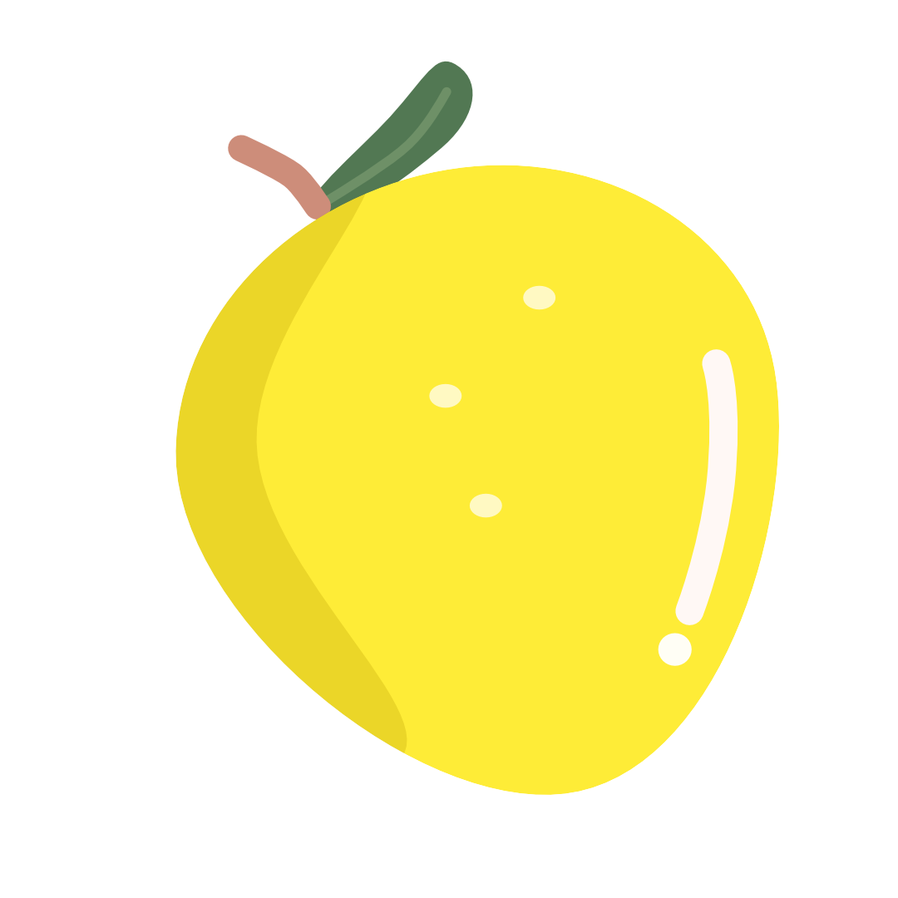

# Yuzu UI

A lightweight, **Preact-based UI library** for creating reusable and accessible
components. Built for developers who need fast, composable, and design-friendly
solutions.

## A History

Inspired by the Japanese _Yuzu_ fruit, **Yuzu UI** is a component library
designed for modern web development. Just like the _Yuzu_ fruit adds a zesty
twist to culinary experiences, **Yuzu UI** brings a refreshing and modular
approach to user interface design.

## Features

- **Preact Compatibility**: Fully optimized for [Preact](https://preactjs.com/),
  ensuring fast rendering and a small bundle size.
- **Customizable**: TailwindCSS integration for styling flexibility.
- **Type-Safe**: Written in TypeScript for improved developer experience.
